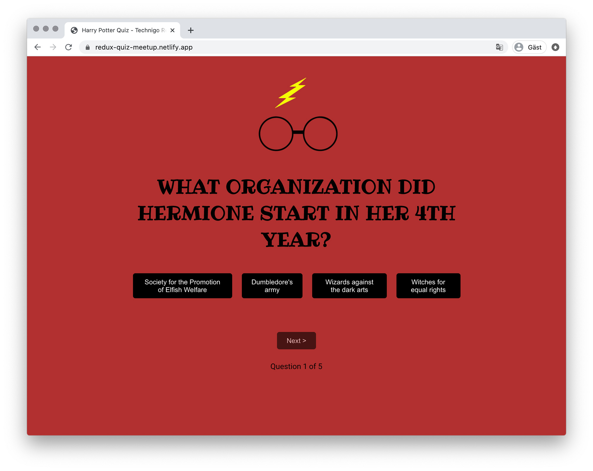

# Redux quiz - Technigo virtual meetup&ensp;|&ensp;[View Live &#10555;](https://redux-quiz-meetup.netlify.app/)

An introduction to React Redux as well as a developer team practice. We created a Harry Potter quiz from a pre-defined reducer, a practice in interacting with the Redux store using selectors and dispatching actions. 

The project was done with mob-programming using VS Code Live View, first as the whole group of seven and then split into smaller groups to focus on specific problems.

## Core Tech
* React
* React Redux
* Redux Toolkit
* Mob Programming

## Screenshot

## View it live
https://redux-quiz-meetup.netlify.app/

