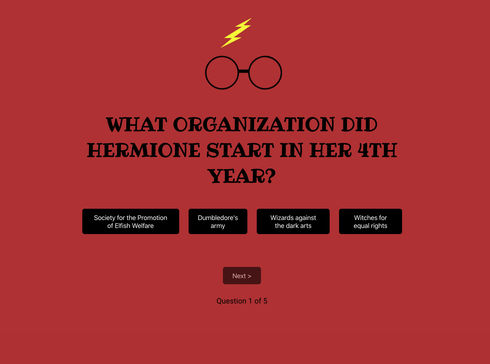

# Redux quiz - Technigo virtual meetup

An introduction to React Redux as well as a developer team practice. We created a Harry Potter quiz from a predefined reducer as a practice in interacting with store using selectors and dispatching actions. The project was done with mob-programming using VS Code Live View, first as the whole group of 7 and then split into smaller groups to focus on specific problems.

## View it live

https://redux-quiz-meetup.netlify.app/

